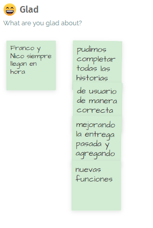

# Tercera iteración

## Objetivos del sprint

Como este es el último sprint donde se va a desarrollar prototipos, nuestro objetivo principal es finalizar con todas las historias de usario que tenemos hasta el momento y mejorar las interfaces con la ayuda de los comentarios que nos hicieron los usuarios al finalizar la iteración anterior.

## Roles por persona

Franco Daneri: Developer

Nicolás Torres: Product Owner y Developer

Lucas Lopez: Scrum Master y Developer

Tomás Clavijo: Developer

**Story Points y velocidad**

En la iteración anterior realizamos 23 story points en 56 horas, lo que implica que realizamos un story point cada aproximadamente 2.43 horas.

Para esta iteración realizamos 8 user stories que suman un total de 20 story points, lo que implicaría unas 49 horas de trabajo si siguieramos al mismo ritmo que la iteración anterior. En la realidad completamos todas las historias de usuario con 48 horas de trabajo, por lo que aumentamos el ritmo en el que completamos cada story point, aunque en muy baja medida.

Como para esta iteración la cantidad de story points era menos, nuestra velocidad fue de 20.

## Metricas

**Tiempo dedicado por rama del proyecto**

Tiempo total horas hombre: 48

Gestión: 10%  

Revisión: 20%  

Implementación: 70%  

**Tiempo por persona**

Franco: 12

Nicolás: 12

Tomás: 12

Lucas: 12

## Trabajo realizado

**Sprint Planning**

**Capturas daily scrum**

Primera daily scrum

Segunda daily scrum

Tercera daily scrum

**Bocetos de la aplicación**  
[Enlace a los bocetos](https://framer.com/projects/Obligatorio-ISA1--tTpcYBayE4l0hXQtDI3a-jivMV?node=Z0WivQWu5)

Al final del documento anexamos capturas de los prototipos

**Road map**  
*Modificaciones realizadas al roadmap*  

**Repriorización de historias de usuario**

***Validación con usuarios***  
Andres Soria: Ex miembro desarrollo de gestión de entregas del correo postal, relacionado con el equipo de "Como ir"  
* Hola Andres, qué tal?  
- Hola chicos  
* Contanos un poco de tu experiencia previa con este tipo de aplicaciones  
- Bueno mira, hace años realice la aplicación del correo para sistematizar las entregas y unificar una web en la que se pueda consultar los distintos códigos postales  
- Mira entra a [http://geo.correo.com.uy/IsisVisualizador/]  
- GeoPostal es el visualizador de mapas implementado por la Administración Nacional de Correos (ANC) para manipular y presentar la información geográfica de relevancia para la empresa.  
* Ese es el sitio que hicieron?  
- Sí, acercá hay un overlays de mapas, entre el que ves por calles y el departamental. Y a la derecha tenes un menú desplegable para buscar por código postal  
- Algo que les puede servir  si tienen que implementar un sistema de lineas sobre el mapa de la ciudad es Qgis y openlayers  para alinear el mapa las lineas, y las paradas  
* Impecable Andres, esta entrega esta centrada en aplicar fundamentos de organización más que en el producto en si, por lo que se nos pidió realizar diseños para la aplicación y no su implementacion  
- Bien  
* ¿Te mostramos las funcionalidades y el diseño y nos das feedback?  
  
**Se discutío en base a los diseños de framer, y la nueva información adquirida fue**  
1) Deberíamos agregar un botón para asignar destinos favoritos tanto de salida como de llegada  
2) Enfocarnos en la simplicidad de uso de las funciones fundamentales, y no en agregar más contenido a la app  

***Sprint Reviews***  
La Sprint Review fue ralizada de forma presencial en horario de clase.

Terminamos con todas las funcionalidades definidas en el backlog desde el incio de la especificación del proyecto, y todas las agregadas posteriormente, con el feedback recibido, contactamos con un experto para validar, y en base a sus concluciones realizamos un cambio menor en el prototipo, conociendo que esta es la ultima iteración en la que podemos desarrollar. En general el producto es redondo, cumpliendo la definition of done antes definida.   

***Sprint retrospective***   
  
  
  
  

[Fotos de metroretro en carpeta capturas de trabajo](capturasDeTrabajo/)

***Bocetos***

.png)

.png)

.png)

.png)

.png)

.png)

.png)

.png)

.png)

.png)

.png)

.png)

.png)

.png)

.png)

.png)

.png)

.png)

.png)

.png)

.png)

.png)

.png)

.png)

.png)

.png)

.png)

.png)

.png)

.png)

.png)

.png)

.png)

.png)
