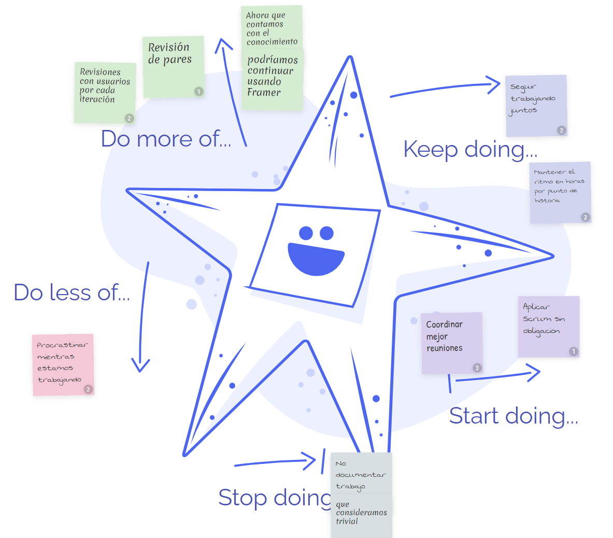
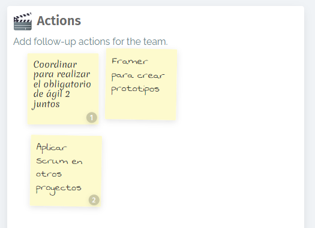

## Roles por persona

Franco Daneri: Developer

Nicolás Torres: Developer

Lucas Lopez: Product Owner y Developer

Tomás Clavijo: Scrum Master y Developer

## Metricas

**Tiempo dedicado por rama del proyecto**

Tiempo total horas hombre: 32

Gestión: 30%  

Revisión: 50%  

Implementación: 20%  

**Tiempo por persona**

Franco: 8

Nicolás: 8

Tomás: 8

Lucas: 8

**Daily scrum**

*Primera daily scrum*

Fue realizada en modalidad presencial y nos encargamos de organizar que tarea iba a realizar quien para la documentación de nuestro proyecto.
Nicolás Torres y Franco Daneri planificaron realizar el video documentación de los bocetos de nuestra aplicación.
Lucas López informó que iba a estar comenzando la documentación del archivo README.md principal.

*Segunda daily scrum*

Fue realizada en modalidad presencial y en ella se informó de la completitud de las actividades informadas el día anterior y se habló del trabajo pendiente para el día actual.
En esta se planificó que todos trabajaran sobre la documentación final del README.md del proyecto.

*Tercera daily scrum*

La última daily scrum tambien fue realizada en modalidad presencial y en esta se planificó la realización de la edición del vídeo documentación, finalización de la documentación y la realización de la Sprint retrospective  

***Sprint retrospective***

