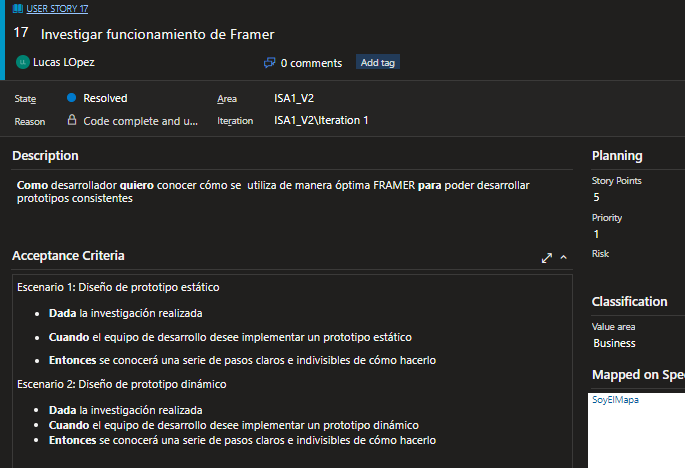
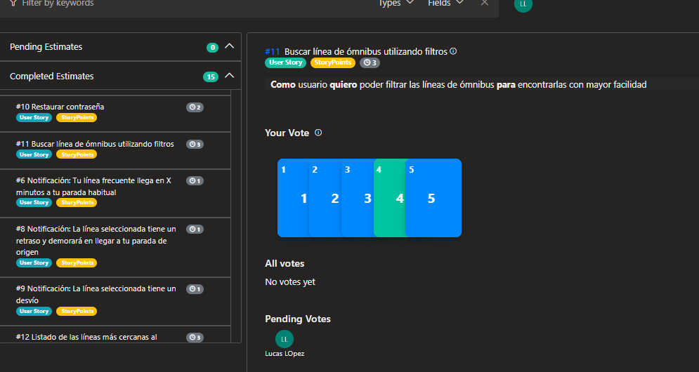
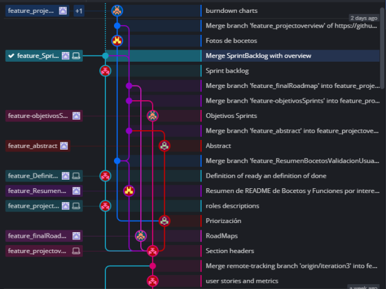

# Entrega final  

BAS surge basándose en el principio de que la movilidad es un derecho al que todos deben acceder, destacando el cuidado ambiental, y la igualdad de oportunidades. Nuestro objetivo es darle a los ciudadanos, turistas, entre otros, la posibilidad de movilizarse en la ciudad que deseen sin verse limitados por diversos factores como el desconocimiento geográfico.
Ayudamos a las personas a llegar de un origen a un destino de manera ágil, teniendo a su disposición todas las líneas de transporte público y las últimas novedades acerca de cada línea.  

## Roles durante las iteraciones  

- Franco Daneri:  Scrum Master  -  Product Owner  -  Developer  -  Developer

- Nicolás Torres: Developer  -  Scrum Muster  -  Product Owner  -  Developer

- Lucas Lopez:    Developer  -  Developer  -  Scrum Master  -  Product Owner

- Tomás Clavijo:  Product Owner  -  Developer  -  Developer  -  Scrum Master  

Estos son los roles principales por integrante, dentro de la iteración todos cumplimos roles de developer de ser necesario.  

### Scrum Team

El Equipo Scrum está formado por un Scrum Master, un Product Owner y desarrolladores. Dentro de un Equipo Scrum, no hay jerarquías, y todos los miembros están centrados construir un Producto que produzca valor para el cliente.

En general los equipos scrum son interfuncionales, nosotros tuvimos que adaptarnos a nuestra carencia del lado de desarrollo de interfaces visuales.

### Developers

En cada iteración, tuvimos miembros dos miembros del equipo como desarrolladores en exclusividad, pero los otros dos complementaban sus funciones con desarrollo, de forma de no sobrecargar a los dos primeros.  
Las tareas de los desarrolladores incluyen:

- Crear el Sprint Backlog
- Cumplir la Definition of Done
- Construir su daily plan en miras de completar los objetivos del sprint
- En general desarrollar módulos de canvas de Framer, por tareas dentro de cada user storie

### Product Owner

El Product Owner es responsable de maximizar el valor del producto, es la conexión entre los usuarios y el equipo Scrum. El Product Owner también es responsable de la gestión eficaz del Product Backlog, que incluye:

- Desarrollar y comunicar explícitamente el Objetivo del Producto
- Crear y comunicar claramente los elementos del Backlog del Producto;
- Priorizar los elementos del Product Backlog

Para que los Product Owners tengan éxito, toda la organización debe respetar sus decisiones

### Scrum Master

El Scrum Master es responsable de la eficacia del Equipo Scrum. Ayudan a aplicar las prácticas de Scrum
para mejorar el desempeño del equipo.

- Ayudar al Equipo Scrum a centrarse en la creación de Incrementos de alto valor que cumplan con la Definition of Done
- Provocar la eliminación de los impedimentos para el progreso del Equipo Scrum
- Asegurar que todos los eventos de Scrum tengan lugar y sean positivos, productivos y se mantengan dentro del margen de tiempo de cada sprint

## Régimen de trabajo

Definimos los sábados, como día de reunión para trabajar en conjunto y poder ayudarnos mutuamente si surgen inconvenientes, en el horario de 9am a 1pm. Durante la semana se organiza el trabajo a realizar o cambios necesarios, así como también discutir las respuestas a preguntas que hicimos a los docentes sobre el proyecto, o feedback recibido por los usuarios. Existieron instancias fuera de este margen de trabajo para ocasiones en las que no fue posible juntarnos el sábado.  

## Métricas

### Tiempo dedicado por ramas del proyecto  

Horas hombre para la totalidad el proyecto : 184 hrs.  
Repartidas en: 48 - 56 - 48 - 32  

Porcentualmente por ramas:  

- Gestión: 80% - 10% - 10% - 30%  
- Revisión: 20% - 20% - 20% - 50%  
- Implementación: 0% - 70% - 70% - 20%  

### Tiempo  por persona  

- Franco Daneri:  12  -  14  -  12  -  8  

- Nicolás Torres: 12  -  14  -  12  -  8  

- Lucas Lopez:    12  -  14  -  12  -  8  

- Tomás Clavijo:  12  -  14  -  12  -  8  

### Puntos de historia por iteración  

| Iteración 0 | Iteración 1 | Iteración 2 | Iteración 3 |
| -- | -- | -- | -- |
| 0 | 20 | 23 | 0 |

**Burndown chart**

Durante la iteración cero, se realizó elicitación de requerimientos y no desarrollo, por lo que no hay puntos de historia implementados en ella, de manera similar en la iteración 3, que se basó en reflexión y aprendizajes de las iteraciones previas, sumado a la creación del video, por lo que tampoco se agregó valor al cliente.

Separamos los Burndown charts en dos tipos, uno específico para las iteraciones de desarrollo en función de los días en los que trabajamos, y otro general con los puntos de historia que realizamos por cada iteración.

Gráfica general:

Gráfica iteración 1:

Gráfica iteración 2:

## Historias de Usuario  

### Creadas durante la iteración 0

### Creadas durante la iteración 1

### RoadMap

Roadmap creado antes de a la iteración 1:

Roadmap creado luego de a la iteración 1:

### Puntos de historia

Estimation Pocker 1

Estimation Pocker 2

En primera instancia realizamos la valoración de las historias de usuario, usando la escala fibonaccii y teniendo en cuenta lo que cada miembro del equipo pensaba que podía a llegar a costar implementar cada historia de usuario relativa a la de iniciar sesión, sin embargo pronto nos dimos cuenta que está información resultaba poco útil pues el trabajo se centra en maquetar las funcionalidades lo cual no tiene relación directa con el coste de realizar la implementación. Por lo que en la iteración 1, realizamos nuevamente una instancia de asignación de puntos de historia, ahora con una escala del 1 al 10, y pensando en el trabajo de maquetado.  

### Priorización

En el momento de priorizar, el product owner indicó a todo el grupo, cuáles eran las historias de usuario que presentaban mayor prioridad para la empresa. Enumerando cada una del 1 al 16, siendo las primeras las más prioritarias y las últimas las menos. Se observa que algunas de las primeras seleccionadas fueron las referentes al login del usuario, la restauración de la contraseña, y el registro del usuario, ya que, sin esto cumplido, el mismo no podrá obtener mayores beneficios acorde a la información brindada, y se ve limitado a recordar siempre la contraseña. Por otra parte, también priorizó las notificaciones que pueden ser más útiles como: informar que la siguiente parada es donde debe bajarse, que la línea seleccionada está próxima a llegar al lugar de origen seleccionado, si la línea presenta un retraso, desvío o cuántos minutos faltan para su llegada. En último lugar, determinó que quedaran las historias de usuario que aportan un valor extra a la aplicación, pero que no son exclusivamente necesarias, como por ejemplo: compartir viajes entre usuarios o tener un historial de los últimos viajes.

### Velocidad

En principio en la primer planning de desarrollo, repartimos todas las historias de usuario entre las dos iteraciones de desarrollo que teníamos, dejando más de la mitad en la primera, previniendo que se pudiesen agregar nuevas funcionalidades en la segunda iteración.
Entonces por un lado el proyecto en sí es date driven, con las entregas marcadas en el calendario de clases, pero por el otro es feature driven desde nuestra perspectiva, pues ajustamos la cantidad de horas que dedicamos al proyecto, en función de las historias que queríamos agregar, podría verse como días de trabajo.

| Iteración | Puntos de Historia | Horas de Trabajo Estimadas| Horas/punto de historia | Horas/P.H |
| -- | -- | -- | -- | --- |
| 1 | 23 | NaN | 56 Reales | 2 horas 26 minutos |
| 2 | 20 | 49  | 48 Reales | 2 horas 24 minutos |

La estimación para la segunda iteración es de 49 horas, viene dado por 2,43 horas * 20 puntos de historia. Levemente mejor por lo que podemos pensar que las estimaciones de puntos de historia fueron cercanas a la relación real de trabajo requerido a una historia comparada con las otras.

### Heurísticas de Nielsen prioritarias

1. Visibilidad del estado del sistema: por ejemplo, si el sistema está cargando las líneas disponibles o sus horarios
2. Coincidencia entre el sistema y el mundo real: Es importante que uses palabras y conceptos que le sean familiares al usuario y le permitan comprender rápidamente qué está pasando.
3. Dale al usuario el control y la libertad: Esta regla habla de darle al usuario el control y la libertad de realizar las acciones que desee. Por ejemplo, eliminar líneas y paradas habituales, cambiar líneas de ómnibus, terminar antes un viaje
9. Ayuda al usuario a reconocer, diagnosticar y recuperarse de los errores. Por ejemplo, si las líneas ingresadas para buscar no existen o no se encuentran coincidencias

### Definition of ready

Los criterios que tomamos para saber si una historia está lista para poder "entrar" en un sprint (definition of ready) son los siguientes:

- Puntos de historia bien definidos
- Prioridad definida
- Es factible, es decir, se puede completar en un sprint
- Tiene definidos los criterios de aceptación
- Cumple INVEST:
  - Independiente: en la medida de lo posible, no existen dependencias con otras user stories
  - Negociable: Se establece en colaboración entre el cliente y el equipo de desarrollo
  - Valiosa: Aporta valor al cliente, genera un Incremento
  - Estimable: Los desarrolladores deben poder estimar la cantidad de story points
  - Pequeña (small): Debe ser pequeña, para que así la estimación sea más precisa
  - Comprobable (testeable): Existe una forma eficaz de determinar si la funcionalidad planteada funciona correctamente

### Definition of done

Los criterios que tomamos para determinar si un incremento del producto se considera terminado (Definition of Done) son:

- El trabajo de cada desarrollador ha sido revisado por al menos otro miembro del equipo
- Todas las pruebas funcionan correctamente
- Cumplir con las heurísticas de Nielsen mencionadas en esta documentación (1, 2, 3 y 9)
- Se cumplen los criterios de aceptación
- Sus campos de texto se encuentran en español
- Para el formato de la aplicación, utilizamos los estándares de Google Material para android:
  - Tipografía: Roboto, con sus 6 tipos de fuente: Thin, Light, Regular, Medium, Bold y Black
  - Escala tipográfica: 12, 14, 16, 20 y 34
  - La paleta de colores será celeste, azul, violeta, blanco y negro

## Objetivos de los sprints

### Iteración 0

Nuestro principal objetivo en esta iteración fue crear todas o la mayoría de las historias de usuario que serían utilizadas por las demás iteraciones desde el product backlog, para luego priorizarlas y estimarlas.

También realizamos un Road Map inicial para programar todas las iteraciones, sabiendo que este era propenso a cambios debido a que no conocíamos nuestra velocidad, ya que nunca habíamos trabajado juntos, y también porque se podrían agregar nuevas historias.

### Iteraciones 1 y 2

Luego de haber creado el product backlog, el objetivo de estas iteraciones fue consumir las historias de dicho backlog, realizando los prototipos de la aplicación número 1 del mercado. Luego de finalizar con las historias propuestas para la iteración, validamos con usuarios para recibir feedback y poder mejorar la iteración.

### Iteración 3

Para finalizar con este proyecto arreglamos algunos errores menores de los prototipos, pero nos centramos en realizar la documentación general del proyecto y crear un video enseñando los prototipos y la funcionalidad de la aplicación.

## Gitflow

Como en este obligatorio no se desarrolló directamente en github, sino en framer, el gitflow lo realizamos separando las ramas por secciones de la documentación, ya que fue lo principal que realizamos por este medio.  

Para ejemplificar, mostraremos parte del flujo de ramas y commits que realizamos:

No realizamos pull request, sentimos que va en contra de los principios que queremos respetar, somos un equipo auto organizado, cada miembro conoce las necesidades, y la visión general del proyecto, tenemos definida la definition of done, y de ready. Para que no sea subjetivo al individuo saber cuándo está listo. Por esto es un overhead hacer review de las pull.

## Bocetos

El producto por construir en este proyecto es un prototipo MVP de una aplicación móvil para ayudar a los usuarios con el transporte público.
Para la realización de este prototipo utilizamos la herramienta Framer que nos permitió crear los bocetos de nuestra solución, incluyendo nuestros propios estilos junto a botones accionables que permiten viajar de una funcionalidad a otra.
Estos bocetos son un acercamiento a como nuestra aplicación funcionaria realmente desde el punto de vista del usuario, que actividades puede desarrollar y que información puede consultar.
Estos bocetos cuentan con una misma guía de estilos, así como una paleta de colores para todas las pantallas de la aplicación.
Para alcanzar este acercamiento primero identificamos el problema a resolver, quienes son los interesados y cuáles son los escenarios principales que le agregan mayor valor. También analizamos a los competidores (Moovit y Como ir), de los que sacamos ideas de mejoras para nuestra aplicación.

## Funciones por interesado

| Funcionalidad | Interesados |
|---|---|
| Login de usuario | Todos, excepto aquellos interesados solamente en conocer cierres en calles, o cambios en líneas de buses |
| Registrar nuevo usuario | Todos, excepto aquellos interesados solamente en conocer cierres en calles, o cambios en líneas de buses |
| Editar usuario | Todos, excepto aquellos interesados solamente en conocer cierres en calles, o cambios en líneas de buses |
| Restaurar contraseña | Todos, excepto aquellos interesados solamente en conocer cierres en calles, o cambios en líneas de buses |
| Configuración de la app | Todos, especialmente aquellos que desean recorrer de manera eficiente, pues pueden personalizar para que se priorice, sin trasbordos o recorridos más cortos  |
| Buscar línea de ómnibus utilizando filtros  | Todos, excepto aquellos interesados solamente en conocer cierres en calles, o cambios en líneas de buses  |
| Buscar ómnibus por destino asignado | Principalmente individuos interesados en utilizar el transporte público para llegar a un destino definido |
| Listado de las líneas más cercanas al usuario con información del destino/origen/tiempo estimado, con la información de cantidad de pasajeros en las mismas | Artistas e Inspectores en particular, pero puede ser útil para todos   |
| Historias de los últimos viajes (líneas de ómnibus utilizadas) |   Inspectores, Artistas, Usuarios que quieren llegar a un destino particular, pues al primero y al segundo le permite recordar para ir alternando de línea, y al tercero para no volver a realizar la misma búsqueda | El usuario debe poder seguir el trayecto de la línea de ómnibus a la que se subió, pudiendo saber en qué parte del recorrido se encuentra, cuáles son las paradas hasta el próximo destino e información del destino | Todos, excepto aquellos interesados solamente en conocer cierres en calles, o cambios en líneas de buses | Compartir mi viaje a otro usuario | Puede ser útil para padres de estudiantes para seguir su recorrido
| Notificaciones | Todos |
| Recargar STM  | Todos, excepto inspectores, conductores, guardas, y aquellos interesados en conocer cierres en las calles |

## Estudio de competidores

Tomamos "Moovit" y "Como Ir" como competidores a investigar

- Login de usuario
  - "Como ir": No tiene
  - "Moovit": No pide login, guarda información en local.
- Registrar nuevo usuario
  - "Como ir": No tiene
    - "Moovit": Al descargar la app, pide datos de medios de transporte del usuario, 
    y dirección de residencia
    Mejoras posibles: Asociar estos datos a la cuenta correspondiente de la app store, 
    de forma de asociar esos datos al dispositivo.

- Editar usuario
  - "Como ir": No tiene
  - "Moovit": No tiene

- Restaurar contraseña
  - "Como ir": No tiene
  - "Moovit": No tiene  

- Configuración de la app*
  - "Como ir": Permite elegir si quiere o no notificaciones
  - "Moovit": Permite configurar preferencias a la hora de elegir el transporte, 
    menor distancia al bus, menos transbordos, recorrido más corto, medio de transporte, 
    ciudad, ver o no puntos de oferta y Cambiar residencia.

- Buscar línea de ómnibus utilizando filtros
  - "Como ir": No se puede navegar por la línea de ómnibus
  - "Moovit": Se puede buscar línea de bus en orden descendente alfabético y numérico,
     buscar por nombre, o filtrar por favoritos.
     *Historia asociada* Agregar favoritos

- Buscar ómnibus por destino asignado*
  - "Como ir": Seleccionas en el mapa el destino, o escribes la dirección, seleccionas la hora de salida, muestra las opciones más cercanas temporalmente de salida y el tiempo necesario para llegar a la parada.
  - "Moovit": Seleccionas en el mapa el destino, o escribes la dirección, seleccionas la hora de salida, muestra las
  opciones más cercanas temporalmente de salida y el tiempo necesario para llegar a la parada.

- Listado de las líneas más cercanas al usuario con información del destino/origen/tiempo estimado, 
con la información de cantidad de pasajeros en las mismas.
  - "Como ir": No tiene
  - "Moovit": No tiene

- Historias de los últimos viajes (líneas de ómnibus utilizadas)
  - "Como ir": No tiene
  - "Moovit": Muestra en el menú principal información del último viaje, y guarda el historial de búsquedas realizadas.

- Modo viaje. El usuario debe poder seguir el trayecto de la línea de ómnibus a la que se 
subió, pudiendo saber en qué parte del recorrido se encuentra, cuáles son las paradas 
hasta el próximo destino e información del destino
  - "Como ir": Muestra en una línea coloreada el recorrido del bus, y puntos en donde están las respectivas paradas,
    a su vez indica distintivamente el destino.
  - "Moovit": Muestra en una línea coloreada el recorrido del bus, y puntos en donde están las respectivas paradas, 
    a su vez indica distintivamente el destino.

- Compartir mi viaje a otro usuario:
  - "Como ir": No tiene
  - "Moovit": No tiene
  - Se podría implementar en base a compartir mediante un link, línea de bus, hora y parada de salida, 
  parada de destino, hora estimada de destino

- Notificaciones:
  - "Como ir": Avisa noticias de cambios en el servicio de bus de Montevideo, cambios de ruta de líneas, paros,
     cambios en el costo, etc.
  - "Moovit": Avisa de nuevas versiones, promociones, alertas sobre líneas favoritas, alertas cuando el bus que 
    estas esperando se acerca, y alertas de cambios de horarios y rutas.

### Product Backlog

Todas nuestras historias de usuarios, a la izquierda, a la derecha su separación en tareas, las tareas no son parte del product backlog, mostramos en esta sección para simplificar.

#### Sprint 1

#### Sprint 2

## Validacion con usuarios

Realizamos 5 instancias de inspección y validación del producto con distintos usuarios para recolectar feedback y realizar ajustes a los prototipos basándonos en dicha retroalimentación.
En la segunda iteración realizamos 3 instancias de validación con usuarios, a Marcos, Hugo y Fiorella, con estas instancias pudimos obtener feedback de nuestros bocetos, sobre todo feedaback orientado a el diseño de la aplicación, desde los colores utilizados, la ubicación de las distintas funcionalidades y faltas de ortografía.
En esta interacción también realizamos una instancia de usability testing donde Nicolás (uno de los miembros del equipo) tuvo el rol de facilitador.

En la tercer iteración realizamos otra instancia de inspección, con Andrés Soria, de la que obtuvimos más feedback. Dicho feedback no fue tan orientado a el diseño de la interfaz como en las anteriores, si no que se centró en las funcionalidades de la aplicación y como podríamos mejorar las mismas.

Estas instancias nos permitieron mejorar nuestro producto, mejorando sus estilos y funcionalidades desde la primer entrega y en las siguientes.

***Información obtenida de las validaciones con usuarios***

  Andres Soria: Exmiembro desarrollo de gestión de entregas del correo postal, relacionado con el equipo de "Como ir"  
    * Hola Andres, qué tal?  
    - Hola chicos  
    * Contanos un poco de tu experiencia previa con este tipo de aplicaciones  
    - Bueno mira, hace años realice la aplicación del correo para sistematizar las entregas y unificar una web en la que se pueda consultar los distintos códigos postales  
    - Mira entra a [http://geo.correo.com.uy/IsisVisualizador/]  
    - GeoPostal es el visualizador de mapas implementado por la Administración Nacional de Correos (ANC) para manipular y presentar la información geográfica de relevancia para la empresa.  
    * Ese es el sitio que hicieron?  
    - Sí, acercá hay un overlays de mapas, entre el que ves por calles y el departamental. Y a la derecha tenés un menú desplegable para buscar por código postal  
    - Algo que les puede servir  si tienen que implementar un sistema de líneas sobre el mapa de la ciudad es Qgis y openlayers  para alinear el mapa las líneas, y las paradas  
    * Impecable Andres, esta entrega esta centrada en aplicar fundamentos de organización más que en el producto en si, por lo que se nos pidió realizar diseños para la aplicación y no su implementación  
    - Bien  
    * ¿Te mostramos las funcionalidades y el diseño y nos das feedback?  
    
    Se discutió en base a los diseños de framer, y la nueva información adquirida fue
    1) Deberíamos agregar un botón para asignar destinos favoritos tanto de salida como de llegada  
    2) Enfocarnos en la simplicidad de uso de las funciones fundamentales, y no en agregar más contenido a la app  

  
  Marcos:
    
   - En inicio sesión, falta una "e" en contraseña
   - En registro de usuarios, a correo electrónico le falta el tilde en la o
   - El logo lo amo, soy ahora mismo logo lover
   - En la pestaña principal, le falta el tilde a querés
   - Y demás me gusta todo, la aplicación así de vista me parece cómoda y sencilla, te dice todo ahí a la vista, no tenés que complicarte para entenderla si nunca la usaste.
   - Así de vista, no la veo cargada de cosas, o sea, me gusta una banda
   - Se ve como que eficiente y rápida de usar
    
  Hugo:
      
  - De vista solo puedo hacer algunos comentarios, ya que a nivel de funcionalidad imposible
  - En algunos lados ponen email y en otro correo electrónico
  - Yo unificaría criterios
  - En inicio sesión y reestablecer contraseña, el espacio qué hay entre el texto de arriba y el espacio para poner el mail me parece demasiado
  - Se comieron la tilde de electrónico en el registro de usuario
  - La opción que dice más no está muy clara para leer, capaz es por la captura
  - Creo que nada más, viéndolo así por arriba
    
  Fiorella, diseñadora gráfica:
  
  - Considero que la idea y el prototipado de la aplicación es muy buena, simplemente les daré algunos tips de detalles mínimos que encontré al revisar detenidamente el proyecto, para así mejorar la interfaz de usuario y que sea más amigable para una aplicación movil:
  - Las letras de la barra de navegación no son completamente legibles, utilizar letras blancas sería una mejor opción
  - Menos espacio entre el título, los inputs y el botón en el inicio de sesión (lo mismo para la página del correo y la contraseña)
  - El mapa puede ser del ancho de la pantalla, pero el resto no (lo mismo para la página de las paradas), y en la misma página los botones van o más arriba o no dejen margen entre el rectángulo blanco y el botón de la página (y que esto se repita cada vez que aparezca en otras páginas)
  - Si hay un input y un botón al lado, intentar poniendo menos palabras o haciendo más chica la letra, que ambos tengan la misma altura
  - En la página de las paradas, dejar más espacio entre el mapa y las paradas o no pensar las paradas como un box sino que no dejar márgenes en los bordes y que vaya de lado a lado tomando toda la pantalla.
  - En la misma página, para el mensaje de las paradas yo haría esto:
    - Que el color sea o el mismo que los botones, o el mismo que la barra de navegación, u otro complementario como un amarillo o naranja (al ser otro azul, pero de otra gama, queda raro, capaz probar con negro y lo de adentro que sea blanco), y sacarle el borde negro
    - No ocultaría la barra de navegación cuando aparece (porque si no, como vuelven para atrás?)
    - Ya lo pondría desde un comienzo con el texto "Aun no se definió el destino" y así ya tomarlo en cuenta para la distribución de los elementos
  - Definir un tamaño de fuente para cada elemento, es decir, los títulos de un tamaño, los placeholders de otro, los botones de otro (pueden ser el mismo entre ellos igual)
  - Definir un tamaño de margen lateral, superior (con respecto a la barra de navegación) y el inferior
  - Definir 2 colores y usar 1 para los botones, y otro para la barra de navegación

Se realizaron más revisiones con usuarios, pero que no aportaron feedback adicional a las antes mencionadas  

***Test de usabilidad***  

Nicolás Torres realizó un test de usabilidad interpretando el rol de facilitador guiando al participante a realizar determinadas actividades que serían las más importantes en un ambiente real.  

Yazmín, tester profesional:  
  - "En mi opinión los prototipos están bastante bien logrados, lo único que les recomendaría es que cuando muestran las notificaciones, al ser prototipos estáticos, no aparezcan los campos de texto detrás de la notificación, sino que simplemente el botón de continuar y la notificación, ya que si no queda raro."  

## Ceremonias de Scrum

### Sprint Retrospective

Al finalizar cada sprint, realizamos sprint retrospectives con la ayuda de metroretro.io, para así tener una oportunidad en la que todo el equipo pueda evaluar lo que salió bien y mal en el sprint, inspeccionando las personas, los procesos y las herramientas que utiliza el equipo de Scrum, generando a su vez acciones para realizar en posteriores iteraciones.
Para hacer más amena esta tarea, utilizamos distintos templates en la metroretro, ambientándolo con nuestros gustos.
En caso de que se quiera ver alguna retrospectiva en particular, estas se encuentran en las carpetas de cada iteración dentro de este repositorio.
A su vez, como se verá más adelante, realizamos una retrospectiva general de todo el proyecto.

### Sprint Review

El propósito de la Sprint Review es inspeccionar el resultado del Sprint con respecto al producto y determinar futuras adaptaciones. El Equipo Scrum presenta los resultados de su trabajo a los principales interesados y se discute el progreso.
Estos interesados son clientes y usuario finales, dentro de los grupos de interés definidos.
Durante el evento, el Equipo Scrum y las partes interesadas revisan lo que se logró en el Sprint y lo que ha cambiado en su entorno. Sobre la base de esta información, los asistentes colaboran en lo que debe hacer siguiente. El Backlog del Producto también puede ser ajustado para satisfacer las nuevas oportunidades. La Revisión del Sprint es una
sesión de trabajo y el Equipo Scrum debe evitar limitarla a una presentación.

En nuestro caso tuvimos dos review, correspondiente a las dos iteraciones de desarrollo. Durante la primer review, cada miembro del equipo consiguió usuarios a los cuales mostrarles el resultado del producto en el sprint, no solo limitándose a ser tarea del product owner. Con esta review, conseguimos mucho feedback que apuntaba principalmente a la usabilidad del producto, en general los usuarios estuvieron contentos con las funcionalidades presentes, y no hubo solicitudes de otras nuevas, los comentarios estaban dirigidos a como interactuar con la aplicación, con esto nos definimos una nueva historia de usuario "Mejorar la UI a partir de las validaciones".

En el segundo sprint review ¿Se buscaba recibir feedback? Sí, pero a una escala menor en la que se pudieran ultimar detalles, puesto que en teoría la próxima iteración no sería de desarrollo. En esta contactamos con un experto para validar, y en base a sus conclusiones realizamos un cambio menor en el prototipo, pero que agrega valor de forma significativa al usuario, como son los lugares favoritos, o frecuentes.

Desde el panorama amplio, podemos decir que completamos en ambas todas las tares vinculadas al sprint backlog de esa iteración, y no hubo problemas mayores o ajustes que surgieran de situaciones por falta de tiempo, todo lo contrario agregamos nuevos requerimientos a nuestro producto, esto también parte de que organizamos el roadmap para tener estas oportunidades de crecimiento, pues sabemos que el software es cambiante, y nos adelantamos a que nuestros requerimientos cambien con ello, aunque en la letra del obligatorio tengamos un contrato, de funcionalidades a requerir.

### Daily Scrum

Realizamos daily meetings en todas las iteraciones, 2 en la iteración 1, 4 en la iteración 2, 3 en la iteración 3 y 3 en la iteración 4.

En las primeras tres iteraciones fueron realizadas en modalidad remota y en la ultima iteración las realizamos de manera presencial. En todas las reuniones estuvieron presentes todos los miembros del equipo comunicándose en llamada por Discord y dejando un registro en mensajes de lo que se habló en la reunión, es decir, que tareas se realizaron el día anterior y lo que iba a estar realizando en ese día cada uno de los miembros.

Como documentamos en la sección de roles, cada miembro del equipo ocupó todos los roles, esto quiere decir que en cada iteración tuvimos dos developers, un scrum master y un product owner, pero el scrum master y el product owner se encontraban trabajando activamente en items del Sprint Backlog por lo que participaron como Developers.

La estructura de nuestras reuniones fue sencilla, simplemente comunicar en lo que se trabajó el día pasado y lo que se iba a estar realizando el día actual, de esta manera conseguimos que siempre tuviéramos un plan de acción para los próximos días de trabajo.

A través de estas reuniones conseguimos una comunicación eficaz, para promover la toma de decisiones rápidas e identificar posibles impedimentos de algún miembro del equipo a la hora de trabajar.

A pesar de contar con daily scrums, no fueron las únicas instancias en las cuales se ajustaron los planes, los miembros del equipo siempre estuvieron disponibles para solucionar cualquier problema de planificación o para discutir detalladamente los planes.

### Sprint Planning

Realizamos dos sprint plannings, una en la iteración 1 y otra en la iteración 2 de nuestro proyecto.
En cada una de estas reuniones se asignaban los roles a cada miembro del equipo y se discutían entre los desarrolladores y el product owner los ítems del product backlog a trabajar para que luego los desarrolladores eligieran los ítems basándose en la prioridad e importancia de los mismos.

Luego de elegido los elementos a trabajar los developers descomponían las historias de usuario en tareas mas pequeñas y se las autoasignaban entre ellos para llegar a un incremento de valor al final del sprint.

## Valor Agregado

Nuestra propuesta se diferencia en la capacidad del grupo de crecer y adaptarse al cambio, mediante el análisis de competidores, y brainstorming por parte del propio equipo llegamos a varias funcionalidades que agregan valor al producto fuera de las ya previamente asignadas por letra. Nuestro pilar fundamental es "make it simple, make it usefull", en primera instancia definimos 3: Búsquedas por destino definido, configuración de Perfil y Recarga de STM, con ellas planteadas filtramos por lo que aporte mayor valor produciendo la menor complejidad posible para el usuario, por los quedamos con búsqueda por destino definido, dado nuestras consultas a usuarios potenciales, es una función muy requerida.
Durante las instancias de feedback con usuario, llegamos a una historia de usuario más, agregar favoritos, de forma que el usuario acceda de manera rápida a sus destinos y líneas habituales.

Nos distingue nuestro acercamiento con los clientes, y con figuras con conocimiento en el área, entrevistamos a Andres ex miembro del equipo encargado de realizar GeoPostal, app similar a como ir, pero para carteros. Múltiples tester que nos aconsejaron en nuestros desaciertos, y una diseñadora gráfica que oriento nuestros prototipos, para ser más inclusivos y más atractivos.

***Sprint retrospective final***

## Reflexión

## Reflexión Grupal

Aunque el objetivo del proyecto es aprender a aplicar metodologías Scrum, y no el desarrollo de una app a nivel funcional, se sintió traída a tierra, y real en sus implicancias. Elicitar y principalmente interactuar con posibles usuarios, es una experiencia invaluable que de nuestro lado, como usuarios tendemos a requerir diferentes necesidades que los usuarios, que no se dedican al software desde nuestro lado.
Aplicación de Scrum: es probable que el potencial real de la metodología no estuvo a nuestro alcance, por la escala y naturaleza del proyecto, en la retrospective se dieron situaciones en las que no sabíamos sinceramente que más podíamos agregar. Esto no quita que vimos destellos de su potencial, el product backlog y posteriormente el sprint backlog, separado por sus tareas es muy cómodo de trabajar, y organizar trabajo que repartimos en las daily antes de continuar desarrollando, y pensamos seguir utilizando este artefacto de aquí en adelante.
Hasta ahora nosotros hemos trabajado en grupos de a dos, cuatro es un reto logístico, se complica organizarnos para tener horarios disponibles en los que podamos estar todos, se complica repartir el trabajo, no hay tanta presión para que todos los miembros trabajen, es decir cada uno se siente menos responsable del resultado del producto, todas estas siendo situaciones problemáticas.
Pero no precisamos estar 5 horas en las que coincidamos, con coincidir 15 minutos en la daily, repartimos el trabajo ¿cómo nos aseguramos que no sé sobrecargue uno de nosotros más que los otros? Repartimos las historias de usuario basado en sus puntos de historia, para que cada uno haga una cantidad relativamente equivalente que los otros, siempre pudiendo decidir cuáles de ese conjuntos de tareas quiere hacer cada uno.
A nivel de tecnologías, Framer fue útil para trasmitir la idea conceptual a algo tangible que podemos mostrarle al usuario, en contra sentimos que tiene varias limitaciones, y la curva de aprendizaje puede ser complicada, para el tipo de programa que es. Ya habiéndonos adaptado luego de tener un template del proyecto agregar nuevas ventanas es muy sencillo, la escalabilidad que podemos conseguir es más que suficiente.
Azure DevOps es muy útil para mantener el proyecto y la organización, creemos que faltaría de un equipo más grande, para realmente que rinda beneficios importantes utilizarla, a organizarnos por mensaje.

Para cerrar, un comentario hacia la materia, por dar un ejemplo en Diseño de Aplicaciones tenemos un foro del obligatorio donde paulatinamente se agregan nuevas restricciones y requerimientos sobre el producto. En el caso de esta materia quedaba completamente en nuestro poder qué más queremos agregar, basado claro en las validaciones que realizamos y el estudio de mercado correspondiente. Sin embargo, quizá esta bueno que se implemente en esta materia algún mecanismo de esta índole, para adaptarlo mejor a lo que es un proyecto ágil, pues por la letra nosotros tenemos un contrato definido de requerimientos a cumplir que no varía y se nos es dado desde un principio, un enfoque que recuerda en gran medida a metodologías más tradicionales, aunque luego en el proceso si lo trabajemos de manera agil.

### Franco Daneri

Este proyecto nos permitió aprender desde la práctica, como es participar de un equipo ágil y cómo se gestionan los mismos.
La rotación de los distintos roles a través de todos los miembros del equipo nos permitió a todos tener un mayor conocimiento de las actividades de cada uno de los roles, no solo desde el punto de vista del desarrollador que es generalmente el rol que desempeñamos en un ambiente real al principio de la carrera.
También es de destacar la utilización de herramientas específicas para la gestión de equipos como es el caso de Azure Devops con sus herramientas cómo realizar la gestión de backlogs, realización de roadmaps, sesiones de estimación entre otras.

### Tomas Clavijo

En el transcurso del proyecto aprendí de manera práctica que la agilidad es una filosofía de trabajo que permite a las organizaciones adaptarse a su entorno para mantenerse competitivas. En cada iteración pude observar el dinamismo que caracteriza a la industria del software, donde un proyecto se puede ir modificando en base a los comentarios recibidos por terceros, las necesidades que vayan surgiendo, entre múltiples factores. Comprendí la utilidad viendo que cada vez los avances son más acelerados y las organizaciones deben ser más flexibles y organizadas, trabajando con todas sus áreas en conjunto para avanzar, como lo dice el término "Scrum", referente al ámbito del rugby, todos unidos yendo hacia adelante. Me pareció interesante el aspecto de la comunicación y los roles asignados, permiten comprender que el trabajo en equipo siempre es más efectivo, atacando el individualismo y brindándole confianza a los demás; rompe con el esquema de "todo lo hago yo porque lo hago mejor".  
Destaco la utilidad que estos conceptos y estas prácticas tienen, no solo para el ámbito del software, sino para la vida cotidiana.
Por último, el proyecto me permitió conocer nuevas herramientas como Azure Devops y Framer, las cuales me resultaron de mucha utilidad, y serán tenidas en cuenta para el futuro.  

### Lucas López

Trabajar en grupo es complicado, pero también muy gratificante, entre todos hicimos un mejor trabajo que lo que cada uno puede aportar individualmente si repartiéramos el trabajo. Scrum hasta ahora ha probado ser para mi, LA manera de organizar equipos no tan pequeños como son 4 personas. Hasta ahora mi metodología, consistía en enviar mensajes por whatsap con lo que me parecía que tenía que hacerse, esto es poco práctico no se logra repartición equitativa, y se daba solapamientos entre lo que hacía con mis compañeros que nos hacían perder tiempo posterior decidiendo que implementación agregar. Con Srum estos problemas se solucionan, con el product backlog, las sprint plannings, y las daily, por ahora no veo el uso en futuro cercano de las review, hasta que empiece a trabajar en un proyecto real, sin embargo el conocerlo adelanta, más que he podido ver, que la mayoría de empresas con las que he interactuado utilizan metodologías agiles, y en concreto artefactos de Scrum. Azure DevOps, es una herramienta diría que es necesaria conocer por todos los desarrolladores, como puede ser git. Y Framer puede ser usado si alguna vez decido crear mi propio proyecto independiente.
El proyecto dio para mucho, pudimos contactar desarrolladores experimentados, tester, etc. Cuyas charlas se extendieron más allá del proyecto y fue una buena experiencia para conocer el día de lo que puede ser nuestro futuro.

### Nicolás Torres

Gracias a este obligatorio, logramos comprender la importancia de las metodologías ágiles, y considero que estas técnicas nos serán de gran utilidad en nuestra vida profesional. Con Scrum, pudimos organizar el proyecto de forma tal que no hiciéramos toda la semana antes de la fecha de entrega como suele ocurrir, sino que fuimos repartiendo el trabajo a lo largo del curso, cosa que me parece estupenda.
Con respecto al trabajo en equipo, me parece que todos hicimos un muy buen trabajo y logramos organizarnos de forma tal que cumpliéramos con todos los requerimientos, aunque me parece apropiado destacar la falta de respeto y compromiso con la materia por parte de uno de los integrantes del grupo que faltó a nuestras dailys en reiteradas ocasiones.
A pesar de esto, fue lindo trabajar con ellos, y si esa persona arregla sus actitudes me gustaría trabajar con ellos en ISA2.

## Vídeo exposición de BAS

[Enlace a Stream](https://web.microsoftstream.com/video/264a9401-618f-4f43-8e91-d8985dcc906c)